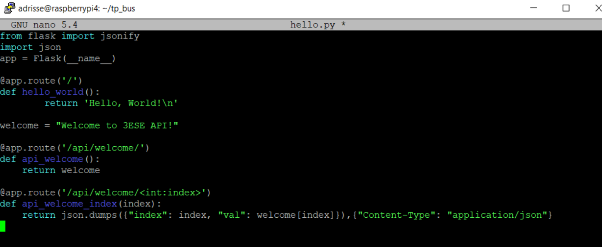

# TP de Bus et Réseaux industriels (ESE)
## Clarisse CHENG, Adrien LENOIR

### Séance 1 :

* Composant BMP280 :
L'adresse 7 bit du composant est "111011" pour les 6 premiers bits, le 7eme pouvant changer lors de l'utilisation via le port SDO. Il ne faut pas laisser tel quel le pin SDO, sinon l'adresse restera indéfinie. Le CSB doit être connecté à VDDIO pour selectionner la communication en $I_2C$. GND doit être connecté à VDDIO via une résistance de pull-up externe. Pour utiliser le mode lecture (-> 111011x1), il faut d'abord générer un "start" ou un "stop" en mode écriture (-> 111011x0)

Les timings de communication en $I_2C$ avec le capteur sont présentés dans le chronogramme suivant

Enrichi par les valeurs suivantes

Il faut songer à ajouter à ces valeurs :
* 100 ns entre SDK et SDI (dans ce sens) en entrées dans les modes "standard" et "rapid", et seulement 20 ns dans le mode "high-speed";
* 140 ns entre SDK et SDI (dans ce sens) en sorties dans les modes "standard" et "rapid", et seulement 70 ns dans le mode "high-speed".

Le registre 0xD0 permet l'identification du composant, ici, 0x58.

Le bit de contrôle 0xF4 permet la selection du mode de fonctionnement, ses deux bits de poids le plus faible "Mode[1:0]" doivent être placés à 0b11 pour un fonctionnement en mode normal.

Les 6 bits de poids fort du registre 0xF4 (respectivement 7, 6, 5, et 4, 3, 2) servent respectivement à régler l'*oversampling* sur les mesures de pression et de température. En fonction de ces réglages, les valeurs de pression et de température sont inscrites sur 16 à 20 bits.

Les registres 0xFA à 0xFC contenant la valeur de température. Plus précisement, ce sont les registres 0xFA et 0xFB, voire les 4 bits de poids fort du registre 0xFC, selon la taille (16 à 20 bits selon le réglage) de la mesure de température.

Les registres 0xF7 à 0xF9 contenant la valeur de pression. Plus précisement, ce sont les registres 0xF7 et 0xF8, voire les 4 bits de poids fort du registre 0xF9, selon la taille (16 à 20 bits selon le réglage) de la mesure de pression.

Les fonctions permettant le calcul de la température et de la pression compenssée, en entier sur 32 bits :
$$data_{filtered} = \frac{data_{filtered, old}(K_{filter} - 1) + data_{ADC}}{K_{filter}}$$

Le pin-out du capteur est décrit ci-après :

Les premiers bus dont nous auront besoin sont le bus $I_2C$ et le bus UART (on USB). Les broches PB8 et PB9 seront ici réservées pour la communication en $I_2C$ avec le capteur BMP280 (Elles seront remplacées plus tard par les broches PB6 et PB7, pour laisser la place au CAN), les broches PA2 et PA3, pour la liaison UART nous permettant d'observer les résultats attendus.

En modifiant la fonction appelée par *printf*, on peut rediriger le retour des informations *via* l'appel de cette fonction vers la console, grâce à l'USART on USB. Tout se passe, d'apparence, comme si la carte Nucleo avait pour sortie standard l'écran du PC.

En reprennant le code des fonctions fournies pour l'acquisition de mesures de pression et de température, et en y ajoutant les formules de compensation inclues dans la documentation du capteur, on obtient le code visible dans [BMP280_driver](BMP280_driver).

### Séance 2 :

On commence par télécharger le système d'exploitation "Raspberry Pi OS (32-bit) Lite" sur le carte SD à insérer dans la carte Raspberry Pi, *via* le logiciel Balena etcher. On rajoute ensuite dans la partition boot de la carte les fichiers "ssh" (vide) et "wpa_supplicant.conf" avec le contenu fourni. C'est dans ce dernier que l'on décrit notre identifiant utilisateur, ainsi que notre mot de passe. On active ensuite la connexion au GPIO et on le libère l'UART du noyau pour pouvoir s'en servir sans problème. Il nous reste plus qu'à se connecter à notre carte depuis notre ordinateur *via* le logiciel Putty.

Le port série du Raspberry est testé en bouclage sur lui-même avec le logiciel minicom.

En ajoutant une ligne à la redéfinition de la fonction *fputc*, on peut faire en sorte que le *printf* envoie les informations à afficher vers les deux ports séries :
*HAL_UART_Transmit(&huart5, (uint8_t \*)&ch, 1, 0xFFFF);*

On forme ensuite une version simplifiée de shell pour la carte STM32, placée directement dans le vecteur d'interruption de l'UART5, dont le code est visible [ici](stm32f4xx_it_partiel.c), afin que le Raspberry puisse lui envoyer des requêtes concernant la mesure de pression et de température.

### Séance 3 :

#### Création du serveur sous Python

*Les codes Python relatifs à cette partie se trouvent [ici](hello.py).*

Afin de pouvoir envoyer des requêtes depuis python, on installe *Python3* ainsi que la bibliothèque *pyserial* et *flask* sur la carte Raspberry.

On créé le fichier hello.py, qui sera à la base de l'arborescence du serveur. On lance celui-ci avec la commande *flask run* et on observe le retour de l'execution de ce script avec la commande *curl*, comme sur les figures ci-dessous.

Pour étendre le fonctionnement du serveur hors de la loopback, on applique la commande flask run en modifiant le flag *FLASK_ENV* ("FLASK_ENV=development").

#### Interface REST

On peu ajouter d'autres commandes à lancer dans des sous-repertoires afin de vérifier le bon fonctionnement du serveur, comme dans la route "/api/welcome/" avec un message de bienvenue, le résultat est visible ci après.

Le serveur semble bien fonctionner.

* Décorateur *@app.route*

*@app.route* est un décorateur de fonction Python, c'est ce qui permet de modifier le comportement d'une autre fonction. Ainsi, ce décorateur indique que les requêtes qui pointent vers l'url "/api/welcome/" devront obtenir comme réponse un appel de la fonction *api_welcome()*. Celle-ci nous renvoie la chaîne de caractère "Hello World!"

* Fragment *<int:index>*

Ce fragment servira à selectionner un numéro de caractère dans la chaîne welcome. Plus particulièrement, lorsqu'on écrit un chiffre supérieur au nombre de lettres de *welcome*, une erreur python s'affichera alors: *\__\_ERROR\_\_*.

Nous souhaiterions que le retour du serveur se fasse sous le format JSON. Tout d'abord, nous utiliserons la methode *json.dumps()*. Problème, à l'observation de l'entête *Content-Type*, le résultat n'est pas sous le bon format.

On explore deux méthodes pour que le format soit bien du JSON.

##### Méthode 1

On peut simplement rajouter un argument à la méthode *json.dumps()* : *{"Content-Type": "application/json"}*.

Le résultat est conforme :

##### Méthode 2

Onn peut aussi utiliser la foncvtion *jsonify()*, qui transforme le résultat directement sous le format adéquate, comme ci-après :

Encore une fois, le retour du serveur se fait bien sous le format JSON.

### Séance 4 :
Afin de pouvoir utiliser correctement la carte moteur, on utilise une fréquence de communication CAN de 500 kbits/s.
Les broches PB8 et PB9 sont de la carte Nucleo sont configurées en CAN_Rx et CAN_Tx respectivement.

Après de nombreux échecs de mise en rotation du moteur, il a fallu réinitialiser la carte de commande car elle ne fonctionnait plus.
